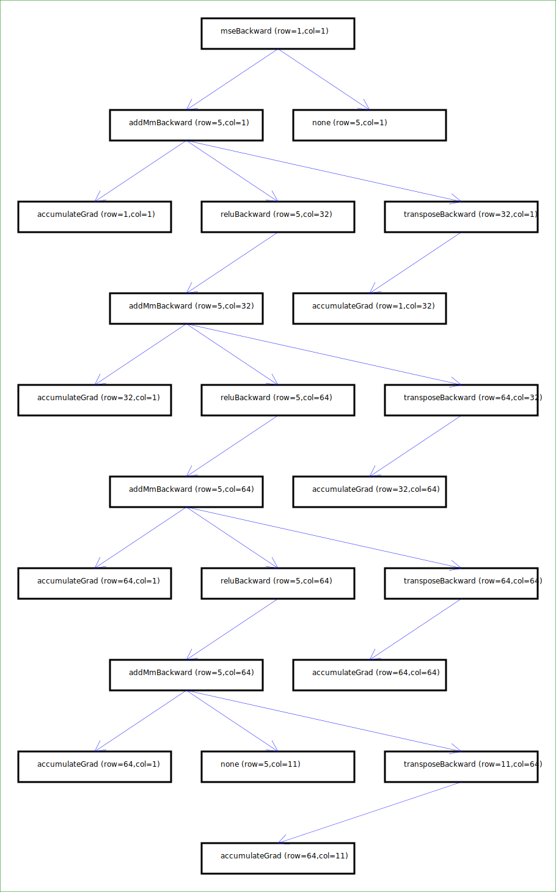
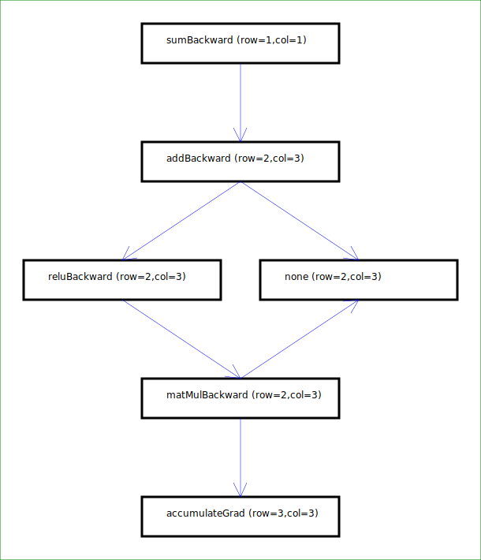

# C++ implementation of Neural Network Capabilities from Scratch

This project implements neural network nodes structure with forward and backward passes, 
it automatically creates Directed Acyclic Graph (DAG) with referencing to PyTorch Autograd 
structure. Moreover, gradient can be back-propagated layer by layer to the leaf nodes, 
by handcrafting custom gradient calculation methods. We uses C++ Eigen Library for 
common matrix utilities (for now), considering we only uses batched 1D inputs. 

This is my hobby project so please don't use this for any kind of production level 
tasks. It only serves as a purpose of strengthen my deep learning understanding 
and C++ skills.  

## Capabilities

- 100% Compatible with C++11 standard.
- Simple modeling for Multilayer Perceptron, aka all layers are Fully Connected. 
- Backward Graph Generation.

## Requirements

Install the standard C++ Eigen Library (for basic 2D matrix operations)

Install the standard C++ Boost Library (for enum to string capabilities).

Download [Nlohmann JSON Utility](https://github.com/nlohmann/json/blob/develop/single_include/nlohmann/json.hpp) (for model saving).
Copy the header file content to `nlohmann/json.hpp` within your include path.
Please verify including the directive `#include <nlohmann/json.hpp>` works.
 
Download [Adishavit SVG Utility](https://github.com/adishavit/simple-svg/blob/master/simple_svg_1.0.0.hpp) (for graph generation).
Copy the header file content from the link above to `svg.hpp` within your include path.
Please verify including the directive `#include <svg.hpp>` works.


## How to run the code

On Windows or Linux, run make:
```
make
```

to compile the executables. 

Run `./autotest.exe` to verify all functionalities are good.

Run `./firstModel.exe` with some commands to run model training on the Wine Quality Dataset: 
Try the following commands
```
# Train model 
# By default, epochs is 100, learning rate is 5e-5, batchsize is 64. 
./firstModel.exe --train -epochs 100 -lr 0.00005 -bs 64 
# Evaluate model
./firstModel.exe --no-train  
```

It has been tested on the same machine, training the model on C++ 
is almost 3x faster compare to training the same model on PyTorch 
(C++ 0.0257724s per epoch, PyTorch 0.0771s per epoch).
We achieve this performance by compiling the scripts using optimization
level 3 (-O3). I have tried -O2 and -O1, all of them gives pretty
similar speed, but it becomes so much slower when not using optimization 
at all.

## Demonstration

Some testing scripts are provided in `main.cpp`, test them by compiling as 
```
g++ -std=c++11 -Wall -Weffc++ -Wextra -Wconversion -Wshadow -O3 -I. -I./include/ main.cpp Deep/*.cpp -o app
```
The flags are the same in the Make file. Running the `app` or `app.exe` afterwards (depends on 
your OS) will 
show two backward graphs saved in svg files: 
`generate1.svg, generate2.svg`.

We built an MLP with some hidden layers, its graph can be seen as below:
(view it in white background if currently your browser is in dark mode.)


We also built a toy example using the formula

$$ L = \sum (\text{ReLU }(XW) + X) $$
with `x.shape=[2,3], w.shape=[3,3]`. 

(view it in white background if currently your browser is in dark mode.)

